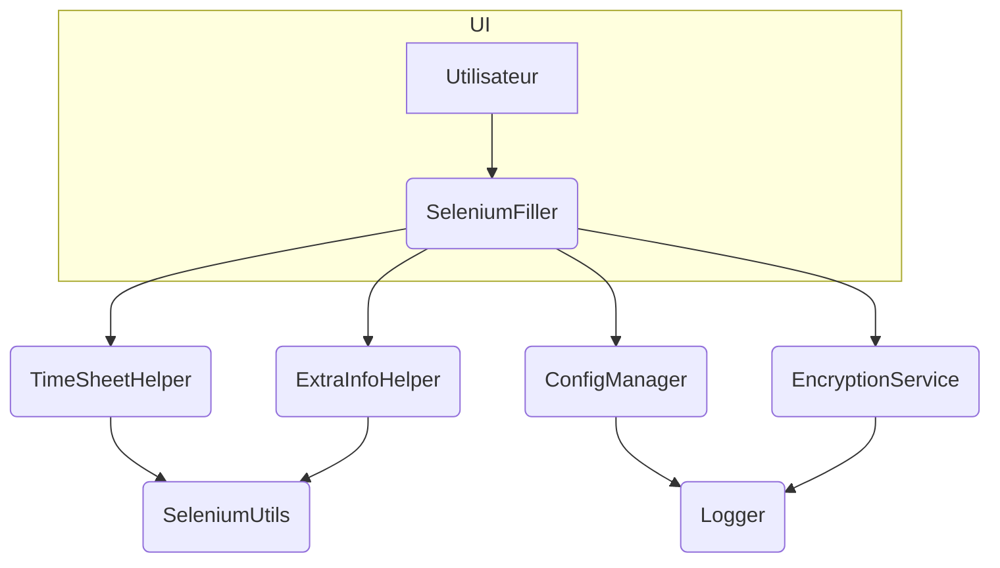

# 🤖 Agent Guide – Projet sele_saisie_auto

## 1. Dev Environment Tips
> ℹ️ Comment configurer et lancer l’environnement local  
- Installer les dépendances : `pip install -r requirements.txt`  
- Pour cibler un agent : exécuter directement le fichier Python correspondant (ex. `python saisie_automatiser_psatime.py`)  
- Les scripts utilisent `config.ini` pour les paramètres. Vérifier son contenu avant exécution.

## 2. Testing Instructions
> ⚠️ Les modifications doivent passer tous les tests et le lint  
- CI YAML : `.github/workflows/ci.yml` (non configuré pour le moment)  
- Lancer les tests : `pytest`  
- Pour un seul test : `pytest -k "<pattern>"`  
- Après refactorings : `flake8` (ou autre outil de lint à configurer).

## 3. Pull Request (PR) Instructions
- **Titre** : `[<nom_agent>] <Résumé concis>`  
- **Description** :  
  1. Contexte et objectif en français  
  2. Étapes pour tester  
  3. Impact éventuel sur les autres agents  
  4. CodecovIA : ajouter à la fin du commentaire PR :  
      - `@codecov-ai-reviewer review`  
      - `@codecov-ai-reviewer test`  
  5. Avant d’ouvrir la PR :
      - exécuter `poetry run pre-commit run --all-files` et `poetry run pytest`. Les deux doivent réussir.
      - execute `radon`, `bandit` et `safety`.

## 4. Codex/ChatGPT Usage Tips
> 🔧 Conseils pour guider l’IA dans ce repo  
- Limiter la recherche aux modules Python concernés (`*.py`).  
- Fournir des extraits de stack trace ou de logs pour le débogage.  
- Demander à l’agent de dessiner un diagramme ASCII/Mermaid avant d’écrire le code.  
- Scinder les grandes tâches en étapes : réécriture, tests, documentation.

## 5. Vue d’ensemble des agents

| Agent                   | Rôle principal                                | Fichier                                   | Entrées               | Sorties                      |
|-------------------------|-----------------------------------------------|-------------------------------------------|-----------------------|------------------------------|
| `SeleniumFiller`        | Remplit la feuille de temps via Selenium      | `saisie_automatiser_psatime.py`           | Config, navigateur    | Feuille de temps complétée   |
| `TimeSheetHelper`       | Remplit les jours dans la grille              | `remplir_jours_feuille_de_temps.py`       | Driver, config        | Statut d’insertion           |
| `ExtraInfoHelper`       | Gère les informations supplémentaires         | `remplir_informations_supp_utils.py`      | Driver, config        | Champs complétés             |
| `ConfigManager`         | Lecture et préparation de `config.ini`        | `config_manager.py`  | Aucune                | Objet `ConfigParser`         |
| `EncryptionService`     | Chiffre/déchiffre les données sensibles       | `encryption_utils.py`                     | Chaîne ou bytes       | Bytes ou chaîne             |
| `Logger`                | Gestion et rotation des logs                  | `logger_utils.py`                         | Messages à enregistrer| Fichier HTML/TXT de logs     |
| `SeleniumUtils`         | Fonctions utilitaires pour Selenium           | `fonctions_selenium_utils.py`             | WebDriver, ID, valeurs| Éléments manipulés          |
## 6. Détails par agent

### `SeleniumFiller`
- **Rôle** : Automatiser la saisie des temps dans PSA Time.
- **Entrées** : configuration, identifiants chiffrés, WebDriver.
- **Sorties** : feuille de temps validée ou messages d’erreur.
- **Dépendances** : `SeleniumUtils`, `TimeSheetHelper`, `ExtraInfoHelper`, `Logger`, `EncryptionService`.
- **Tests** : (non définis pour l’instant).

### `TimeSheetHelper`
- **Rôle** : Remplir les jours et missions.
- **Entrées** : driver Selenium, configuration des jours.
- **Sorties** : liste des jours remplis.
- **Dépendances** : `SeleniumUtils`, `Logger`, `ConfigManager`.
- **Tests** : TODO ajouter `tests/test_timesheet_helper.py`.

### `ExtraInfoHelper`
- **Rôle** : Insérer les informations supplémentaires demandées par CGI.
- **Entrées** : driver Selenium, configuration spécifique.
- **Sorties** : confirmation du remplissage.
- **Dépendances** : `SeleniumUtils`, `Logger`.
- **Tests** : TODO ajouter `tests/test_extra_info_helper.py`.

### `ConfigManager`
- **Rôle** : Charger `config.ini` à l’exécution, fournir les chemins pour PyInstaller.
- **Entrées** : chemin du fichier, options du système.
- **Sorties** : objet `ConfigParser` utilisé par les autres agents.
- **Dépendances** : `Logger`.
- **Tests** : TODO ajouter `tests/test_config_manager.py`.

### `EncryptionService`
- **Rôle** : Gérer la clé AES et la mémoire partagée.
- **Entrées** : données à chiffrer/déchiffrer.
- **Sorties** : données chiffrées ou déchiffrées.
- **Dépendances** : `Logger`.
- **Tests** : TODO ajouter `tests/test_encryption_service.py`.

## 7. Schéma d’interaction

## 8. Ajouter un nouvel agent

1. Isoler une responsabilité unique.
2. Créer un fichier Python dans `./` ou un sous-répertoire avec la classe ou fonction principale.
3. Documenter son rôle dans ce fichier et ici.
4. Ajouter des tests dans `tests/`.
5. Mettre à jour `AGENT.md`.

## 9. Meilleures pratiques

* Un agent = une responsabilité (Single Responsibility).
* Fonctions courtes pour faciliter les tests.
* Dépendances injectées.
* Logs détaillés pour faciliter le débogage.

## 10. TODOs & Améliorations
* [ ] Lier `AGENT.md` depuis le `README.md`.
* [ ] Créer un workflow GitHub Actions pour les tests (`ci.yml`).
* [ ] Ajouter des tests unitaires pour chaque agent.
* [ ] Automatiser la génération du diagramme Mermaid.
* [x] Documenter la procédure d’export en binaire via PyInstaller (voir `README.md`).

## 11. Interfaces détaillées des agents
*(à compléter au fur et à mesure des besoins)*

## 12. Protocoles de messages
*(si des APIs ou sockets sont ajoutés)*

## 13. Surveillance & Performances
*(ajouter des métriques et logs étendus)*

## 14. Gestion des erreurs
*(uniformiser les exceptions et messages)*

## 15. Points d’extension
*(plugins, hooks, etc.)*

## 16. Considérations de déploiement & sécurité
- Scalabilité (multiprocessing si besoin)
- Validation des entrées utilisateurs
- Limites de ressources Selenium

## 17. Documentation
*(compléter avec des guides pas à pas)*
