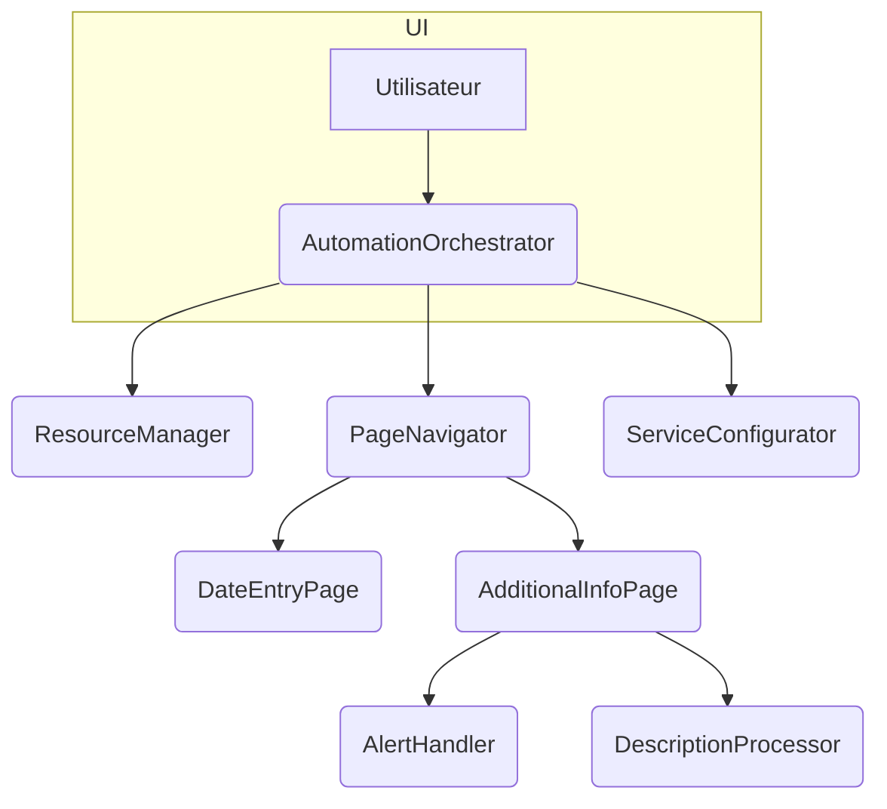

# 🤖 Agent Guide – Projet sele_saisie_auto

## 1. À propos de ce guide
Ce fichier décrit le rôle des différents agents qui composent le projet. Pour la configuration de l'environnement, l'exécution des tests et toutes les étapes nécessaires avant de soumettre une Pull Request, consultez [docs/guides/contributing.md](docs/guides/contributing.md).

## 2. Codex/ChatGPT Usage Tips
> 🔧 Conseils pour guider l’IA dans ce repo
- Limiter la recherche aux modules Python concernés (`*.py`).
- Fournir des extraits de stack trace ou de logs pour le débogage.
- Demander à l’agent de dessiner un diagramme ASCII/Mermaid avant d’écrire le code.
- Scinder les grandes tâches en étapes : réécriture, tests, documentation.

## 3. Vue d’ensemble des agents

| Agent                   | Rôle principal                                | Fichier                                   | Entrées               | Sorties                      |
|-------------------------|-----------------------------------------------|-------------------------------------------|-----------------------|------------------------------|
| `SeleniumFiller`        | Remplit la feuille de temps via Selenium      | `saisie_automatiser_psatime.py`           | Config, navigateur    | Feuille de temps complétée   |
| `TimeSheetHelper`       | Remplit les jours dans la grille              | `remplir_jours_feuille_de_temps.py`       | Driver, config        | Statut d’insertion           |
| `ExtraInfoHelper`       | Gère les informations supplémentaires         | `remplir_informations_supp_utils.py`      | Driver, config        | Champs complétés             |
| `ConfigManager`         | Lecture et préparation de `config.ini`        | `config_manager.py`  | Aucune                | Objet `ConfigParser`         |
| `EncryptionService`     | Chiffre/déchiffre les données sensibles       | `encryption_utils.py`                     | Chaîne ou bytes       | Bytes ou chaîne             |
| `Logger`                | Gestion et rotation des logs                  | `logger_utils.py`                         | Messages à enregistrer| Fichier HTML/TXT de logs     |
| `SeleniumDriverManager` | Initialise et ferme le WebDriver             | `selenium_driver_manager.py`             | URL, options          | Instance WebDriver |
| `SeleniumUtils`         | Fonctions utilitaires pour Selenium           | `selenium_utils/`             | WebDriver, ID, valeurs| Éléments manipulés          |
| `DuplicateDayDetector`  | Détecte les doublons de jours remplis        | `selenium_utils/duplicate_day_detector.py` | Driver, max_rows      | Logs de doublons |
| `BrowserSession`        | Gère l'ouverture et la fermeture du navigateur | `automation/browser_session.py`  | URL, options          | Instance WebDriver |
| `LoginHandler`          | Gère la connexion utilisateur                  | `automation/login_handler.py`    | Driver, identifiants  | Aucune (session ouverte) |
| `DateEntryPage`         | Gère la sélection de période                   | `automation/date_entry_page.py`  | Driver, date cible    | Période validée |
| `AdditionalInfoPage`    | Remplit la fenêtre d'informations supplémentaires | `automation/additional_info_page.py` | Driver, config        | Données enregistrées |
| `PageNavigator`         | Orchestration simple des pages                 | `navigation/page_navigator.py`       | Drivers, pages        | Actions séquencées |
| `ResourceManager`       | Regroupe configuration, chiffrement et session | `resources/resource_manager.py`      | Fichier log           | Contexte partagé   |
| `ServiceConfigurator`   | Instancie les services principaux              | `configuration/service_configurator.py` | Config appli          | Services prêts   |
| `AutomationOrchestrator`| Orchestration haut niveau de l'automatisation   | `orchestration/automation_orchestrator.py` | Services, contexte   | Process complet    |
| `AlertHandler`          | Gestion centralisée des alertes Selenium       | `alerts/alert_handler.py`            | Automation, waiter    | Pop-ups fermées    |
| `DescriptionProcessor`  | Traite les descriptions et remplit les jours   | `form_processing/description_processor.py` | Driver, config       | Jours renseignés   |
| `ElementIdBuilder`      | Génère les identifiants des champs jour        | `elements/element_id_builder.py`     | Base id, indices      | Identifiant        |

## 4. Détails par agent

### `SeleniumFiller`
- **Rôle** : Automatiser la saisie des temps dans PSA Time.
- **Entrées** : configuration, identifiants chiffrés, WebDriver.
- **Sorties** : feuille de temps validée ou messages d’erreur.
- **Dépendances** : `SeleniumUtils`, `TimeSheetHelper`, `ExtraInfoHelper`, `Logger`, `EncryptionService`.
- **Tests** : (non définis pour l’instant).

### `TimeSheetHelper`
- **Rôle** : Remplir les jours et missions.
- **Entrées** : driver Selenium, configuration des jours.
- **Sorties** : liste des jours remplis.
- **Dépendances** : `SeleniumUtils`, `Logger`, `ConfigManager`.
- **Tests** : `tests/test_timesheet_helper.py`.

### `ExtraInfoHelper`
- **Rôle** : Insérer les informations supplémentaires demandées par CGI.
- **Entrées** : driver Selenium, configuration spécifique.
- **Sorties** : confirmation du remplissage.
- **Dépendances** : `SeleniumUtils`, `Logger`.
- **Tests** : `tests/test_extra_info_helper.py`.

### `ConfigManager`
- **Rôle** : Charger `config.ini` à l’exécution, fournir les chemins pour PyInstaller.
- **Entrées** : chemin du fichier, options du système.
- **Sorties** : objet `ConfigParser` utilisé par les autres agents.
- **Dépendances** : `Logger`.
- **Tests** : `tests/test_config_manager.py`.

### `EncryptionService`
- **Rôle** : Gérer la clé AES et la mémoire partagée.
- **Entrées** : données à chiffrer/déchiffrer.
- **Sorties** : données chiffrées ou déchiffrées.
- **Dépendances** : `Logger`.
- **Tests** : `tests/test_encryption_service.py`.

### `SeleniumDriverManager`
- **Rôle** : Centraliser l'ouverture et la fermeture du WebDriver.
- **Entrées** : URL cible et options navigateur.
- **Sorties** : instance Selenium prête à l'emploi.
- **Dépendances** : `SeleniumUtils`, `Logger`.

### `ResourceManager`
- **Rôle** : Fournir configuration, service de chiffrement et session navigateur via un gestionnaire de contexte.
- **Entrées** : fichier de log.
- **Sorties** : objets `AppConfig`, `BrowserSession` et `Credentials` prêts à l'emploi.
- **Tests** : `tests/test_resource_manager.py`.

### `ServiceConfigurator`
- **Rôle** : Préparer les services clés comme `BrowserSession`, `EncryptionService` et `Waiter`.
- **Entrées** : configuration de l'application.
- **Sorties** : dataclass `Services` contenant les instances prêtes à l'emploi.
- **Tests** : `tests/test_service_configurator.py`.

### `AutomationOrchestrator`
- **Rôle** : Orchestrer l'automatisation PSA Time en utilisant les services principaux.
- **Entrées** : configuration, services, contexte.
- **Sorties** : feuille de temps complétée.
- **Tests** : `tests/test_automation_orchestrator.py`.

### `PageNavigator`
- **Rôle** : Séquencer les étapes de navigation entre les pages.
- **Entrées** : sessions et pages.
- **Sorties** : aucune, délègue aux pages.
- **Méthode principale** : `run(driver) -> None` effectue la connexion, la saisie
  et la validation après un appel préalable à `prepare(credentials, date_cible)`
  pour injecter les informations nécessaires.
- **Tests** : `tests/test_page_navigator.py`.

### `AlertHandler`
- **Rôle** : Fermer ou valider les pop-ups d'alerte.
- **Entrées** : instance d'automatisation, waiter Selenium.
- **Sorties** : alertes traitées.
- **Tests** : `tests/test_alert_handler.py`.

### `DescriptionProcessor`
- **Rôle** : Identifier la ligne par description et remplir uniquement les jours vides.
- **Entrées** : driver Selenium, configuration de la description.
- **Sorties** : jours renseignés.
- **Tests** : `tests/test_description_processor.py`.

### `ElementIdBuilder`
- **Rôle** : Générer les identifiants des champs jour selon les règles PSA Time.
- **Entrées** : identifiant de base, indices de jour et de ligne.
- **Sorties** : identifiant complet.
- **Tests** : `tests/test_element_id_builder.py`.

## 5. Schéma d’interaction

## 6. Ajouter un nouvel agent

1. Isoler une responsabilité unique.
2. Créer un fichier Python dans `./` ou un sous-répertoire avec la classe ou fonction principale.
3. Documenter son rôle dans ce fichier et ici.
4. Ajouter des tests dans `tests/`.
5. Mettre à jour `AGENT.md`.

## 7. Meilleures pratiques

* Un agent = une responsabilité (Single Responsibility).
* Fonctions courtes pour faciliter les tests.
* Dépendances injectées.
* Logs détaillés pour faciliter le débogage.

## 8. TODOs & Améliorations
* [x] Lier `AGENT.md` depuis le `README.md`.
* [x] Créer un workflow GitHub Actions pour les tests (`ci.yml`) *(déjà présent)*.
* [x] Documenter la procédure d’export en binaire via PyInstaller (voir `README.md`).
* [x] Ajouter des tests unitaires pour chaque agent.

## 9. Interfaces détaillées des agents

### `EncryptionService` (`encryption_utils.py`)
Service chargé du chiffrement et de la mémoire partagée.

- `generer_cle_aes(taille_cle: int = 32) -> bytes` : génère une clé AES aléatoire.
- `chiffrer_donnees(donnees: str, cle: bytes, taille_bloc: int = 128) -> bytes` : chiffre un texte en AES‑CBC.
- `dechiffrer_donnees(donnees_chiffrees: bytes, cle: bytes, taille_bloc: int = 128) -> str` : déchiffre le résultat précédent.
- `stocker_en_memoire_partagee(nom: str, donnees: bytes) -> SharedMemory` : écrit des octets dans un segment partagé.
- `recuperer_de_memoire_partagee(nom: str, taille: int) -> tuple[SharedMemory, bytes]` : lit un segment existant.
- `supprimer_memoire_partagee_securisee(memoire: SharedMemory) -> None` : efface et supprime le segment.

### `ConfigManager` (`config_manager.py`)
Gestion centralisée du fichier `config.ini`.

- `load() -> ConfigParser` : charge la configuration depuis le disque.
- `save() -> str` : sauvegarde l'instance courante.
- `config` : propriété retournant l'objet `ConfigParser` actif.

### `GUIBuilder` (`gui_builder.py`)
Collection de fonctions pour créer les widgets Tkinter de l'application.

Principales fonctions :
- `create_tab(notebook, title, style="Modern.TFrame", padding=20) -> ttk.Frame`
- `create_a_frame(parent, style="Modern.TFrame", ...) -> ttk.Frame`
- `create_labeled_frame(parent, text="", ...) -> ttk.LabelFrame`
 - `create_modern_label_with_grid(frame, text, row, col, ...) -> ttk.Label`
 - `create_modern_entry_with_grid(frame, var, row, col, ...) -> ttk.Entry`
 - `create_modern_entry_with_grid_for_password(frame, var, row, col, ...) -> ttk.Entry`
- `create_combobox(frame, var, values, row, col, ...) -> ttk.Combobox`
- `create_button_with_style(frame, text, command, ...) -> ttk.Button`
- `create_button_without_style(frame, text, command, ...) -> tk.Button`

### `SeleniumDriverManager` (`selenium_driver_manager.py`)
Enveloppe simplifiée autour du WebDriver Selenium.

- `open(url: str, fullscreen=False, headless=False, no_sandbox=False) -> Optional[WebDriver]` : instancie le navigateur et prépare la page.
- `close() -> None` : ferme le navigateur si ouvert.

### `Logger Utils` (`logger_utils.py`)
Fonctions pour gérer les journaux applicatifs.

- `initialize_logger(config, log_level_override=None)` : applique le niveau de log défini.
- `write_log(message, log_file, level="INFO", log_format="html", auto_close=False, max_size_mb=5)` : écrit un message dans le fichier.
- `close_logs(log_file, log_format="html")` : ferme proprement le fichier de log.

### `Shared Utils` (`shared_utils.py`)
Fonctions de support communes pour la gestion des logs.

- `setup_logs(log_dir="logs", log_format="html") -> str` : prépare le répertoire des logs et retourne le chemin du fichier.
- `get_log_file() -> str` : retourne le fichier de log courant, en l'initialisant si nécessaire.

### `Utils Misc` (`utils/misc.py`)
Outils divers pour la console.
- `program_break_time(memorization_time: int, affichage_text: str)` : affiche un compte à rebours.
- `clear_screen()` : efface la console.

### `DuplicateDayDetector` (`selenium_utils/duplicate_day_detector.py`)
Service chargé de détecter les doublons de jours renseignés.
- `detect(driver, max_rows=None)` : parcourt les lignes et log les jours apparaissant plusieurs fois.

## 12. Protocoles de messages
*(si des APIs ou sockets sont ajoutés)*

## 13. Surveillance & Performances

## 14. Gestion des erreurs
*(uniformiser les exceptions et messages)*

## 15. Points d’extension
*(plugins, hooks, etc.)*

## 16. Considérations de déploiement & sécurité
- Scalabilité (multiprocessing si besoin)
- Validation des entrées utilisateurs
- Limites de ressources Selenium

## 17. Documentation
*(compléter avec des guides pas à pas)*
