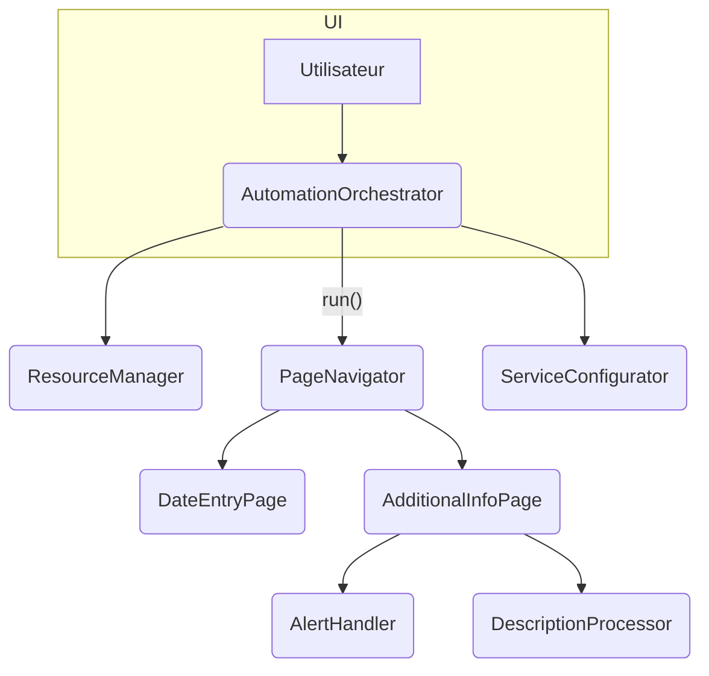

# sele_saisie_auto

[](LICENSE)
[](#)
[](#)
[](#)

## Sommaire
- [Objectif du projet](#objectif-du-projet)
- [Installation](#installation)
- [Lancement](#lancement)
- [Utilisation](#utilisation)
- [Architecture](#architecture)
- [Tests](#tests)
- [Contribuer](#contribuer)
- [Publication d'une release](#publication-dune-release)

<a id="objectif-du-projet"></a>
## 🚀 Objectif du projet
Automatiser la saisie de la feuille de temps PSA Time via Selenium et une interface Tkinter.

## 🧰 Stack technologique
- Python 3.11
- Selenium 4.25
- Cryptography 43.0
- Dev: pytest, flake8, mypy, black, isort, ruff, radon, bandit, safety

## ⚡ Démarrage rapide
```bash
poetry install --no-root
cp examples/config_minimal.ini config.ini  # première utilisation
poetry run psatime-launcher
```

<a id="installation"></a>
## 🔧 Installation
### Pré-requis système
- Python 3.11 et [Poetry](https://python-poetry.org/)
- Sous Windows, suivez [ce guide](docs/guides/install_poetry_windows.md) pour installer Poetry.

### Depuis les sources
1. Clonez le dépôt puis placez-vous dans le dossier :
   ```bash
   git clone <URL> sele_saisie_auto
   cd sele_saisie_auto
   ```
2. Installez les dépendances :
   ```bash
   poetry install --no-root
   ```
3. *(Optionnel)* Installez également la copie en mode développement :
   ```bash
   poetry install
   ```

### Environnement virtuel
Poetry gère automatiquement l'environnement virtuel du projet.

<a id="lancement"></a>
## ▶️ Lancement
Après installation :
```bash
poetry run psatime-launcher
```

<a id="utilisation"></a>
## 📦 Utilisation
Une interface graphique Tkinter demande vos identifiants, les chiffre en mémoire et déclenche ensuite l'automatisation Selenium.
Lors du démarrage, une clé AES temporaire est générée pour chiffrer ces informations dans la mémoire partagée. Aucun identifiant n'est sauvegardé sur disque.


## ⚙️ Utilisation avancée
- Configuration dans `config.ini`
- Logs générés dans le dossier `logs/`

- Exécution sans interface :
  ```bash
  poetry run psatime-auto
  ```
  Cette commande utilise le point d'entrée Python `sele_saisie_auto.cli.main` et crée automatiquement un fichier de log dans le répertoire `logs/` si aucun chemin n'est spécifié. Si `config.ini` ne contient pas `encrypted_login` et `encrypted_mdp`, le programme demande le login et le mot de passe dans le terminal, les chiffre via `EncryptionService` puis les stocke en mémoire partagée.
  Pour ajuster le lancement du navigateur, les commandes `psatime-auto` et `psatime-launcher` acceptent aussi :
  - `--headless`
  - `--no-sandbox`
  - `--cleanup-mem`

Au démarrage, l'outil supprime automatiquement les segments de mémoire partagée restés d'une exécution précédente. 
Si un plantage laisse des segments orphelins, il est possible de les effacer manuellement :
```bash
poetry run psatime-auto --cleanup-mem
```

Les noms des segments peuvent être personnalisés via `MemoryConfig` si plusieurs sessions doivent coexister :

```python
from sele_saisie_auto.memory_config import MemoryConfig
mem_cfg = MemoryConfig.with_pid()  # ou MemoryConfig(suffix="demo")
```

Exemple minimal en Python :
```python
from sele_saisie_auto.navigation import PageNavigator

# après récupération des identifiants et ouverture du driver
navigator.prepare(credentials, cfg.date_cible)
navigator.run(driver)
> **Note :** la logique principale réside désormais dans ``AutomationOrchestrator.run()``.
> Cet orchestrateur utilise un ``ResourceManager`` pour centraliser navigateur et identifiants,
> un ``PageNavigator`` pour enchaîner les étapes et un ``ServiceConfigurator`` pour
> initialiser ``EncryptionService`` et ``BrowserSession``.
> Les pages emploient ``AlertHandler`` pour gérer les pop-ups et ``DescriptionProcessor``
> s'occupe du remplissage détaillé des lignes.
> Toute la navigation se fait via la méthode ``PageNavigator.run``.
  ```

## 🔌 Injection de dépendances
Certaines fonctions acceptent les modules Selenium ou Logger en paramètres pour faciliter les tests. Voir [AGENT.md](AGENT.md) pour plus de détails.


## ❗ Gestion des erreurs
Les exceptions sont journalisées via `logger_utils.py`. Reportez-vous à la documentation interne pour enrichir le mécanisme.

Voici comment décorer une fonction Selenium avec `handle_selenium_errors` :

```python
from sele_saisie_auto.decorators import handle_selenium_errors

@handle_selenium_errors(default_return=False)
def cliquer_bouton(driver):
    driver.find_element(...).click()
```
- `BrowserSession.wait_for_dom` effectue trois tentatives maximum pour vérifier
  la stabilité du DOM. Une `RuntimeError` est levée si le contenu reste instable.

## 📝 Formats d'entrée
Les paramètres sont lus depuis `config.ini` (URL, planning, etc.). Les identifiants sont saisis au lancement et ne sont pas stockés sur le disque.

## Exemple d'algorithme factice
Vous pouvez fournir votre propre logique via le paramètre `algorithm` :

```python
class CustomAlgorithm:
    def solve(self, cube):
        return ["L", "L", "U"]
```

`SeleSaisieAuto` appellera `solve` pour obtenir les mouvements. La fonction `sele_saisie_auto_with_timeout` ignore actuellement totalement le paramètre `timeout`.

<a id="architecture"></a>
## 🧠 Architecture

Cette séparation facilite les tests et l'évolution du code.

**Nouvelles classes principales** :

- **AutomationOrchestrator** : supervise l'ensemble du processus.
- **ResourceManager** : centralise configuration, identifiants et session Selenium.
- **ServiceConfigurator** : prépare chiffrement et navigateur.
- **PageNavigator** : enchaîne connexion et navigation via la méthode unique `run()`.
- **DateEntryPage** : sélection de la période à remplir.
- **AdditionalInfoPage** : saisie des informations complémentaires.
- **AlertHandler** : ferme les éventuelles pop‑ups.
- **DescriptionProcessor** : prépare les descriptions de lignes.
- **date_utils.get_next_saturday_if_not_saturday** : renvoie le prochain samedi si la date fournie n'en est pas un.

Consultez [AGENT.md](AGENT.md) et la
[documentation détaillée](docs/reference/architecture.md) pour plus d'informations.

## 📁 Structure du projet
```
.
├── main.py
├── saisie_automatiser_psatime.py
├── encryption_utils.py
├── remplir_jours_feuille_de_temps.py
├── utils/date_utils.py
├── config.ini
├── tests/
└── ...
```

## 🖥️ Compatibilité Windows
L'utilisation de PyInstaller permet de générer un exécutable Windows.

### Génération pas à pas
Le script `scripts/export_requirements.py` se charge d'exécuter
`poetry export` pour générer le fichier `requirements.txt` nécessaire à
l'installation des dépendances hors de l'environnement Poetry.
1. Exporter puis installer les dépendances :
   ```bash
   python scripts/export_requirements.py
   pip install -r requirements.txt
   ```
2. Depuis le répertoire racine, exécuter PyInstaller avec les fichiers à embarquer :
   ```bash
   pyinstaller --onefile --windowed \
     --add-data "config.ini;." \
     --add-data "calendar_icon.png;." \
     main.py
   ```
3. L'exécutable se trouve dans le dossier `dist/`. Copiez `config.ini` à côté si besoin pour conserver la configuration.

## 🛠️ Fichiers de configuration
- `config.ini` : paramètres de connexion et de planning. Le fichier est lu avec
  `ConfigParser(interpolation=None)` afin de permettre l'utilisation du caractère
  `%` sans interpolation.
- `examples/config_minimal.ini` : configuration minimale à copier pour démarrer rapidement
- `examples/config_example.ini` : modèle listant toutes les sections nécessaires
- `docs/guides/log_style-example.ini` : exemple d'utilisation de `[log_style]`
- `examples/dropdown_defaults.json` : valeurs par défaut des menus déroulants si
  les sections correspondantes sont absentes de `config.ini`
- `pytest.ini` : options de tests
- `.coveragerc` : configuration de couverture
- `.pre-commit-config.yaml` : hooks de lint et formatage

## 🌐 Variables d'environnement
Les valeurs de `config.ini` peuvent être surchargées via ces variables :

- `PSATIME_URL` — URL du portail PSA Time
- `PSATIME_DATE_CIBLE` — date cible au format `JJ/MM/AAAA`
- `PSATIME_DEBUG_MODE` — niveau de log (`INFO`, `DEBUG`, …)
- `PSATIME_LISTE_ITEMS_PLANNING` — liste d'items de planning séparés par des virgules
- `PSATIME_DEFAULT_TIMEOUT` — délai d'attente par défaut pour Selenium
- `PSATIME_LONG_TIMEOUT` — délai prolongé pour certaines opérations
Les variables d'environnement ont priorité sur le fichier de configuration.
Un fichier `.env` peut être utilisé pour définir ces variables mais sera
écrasé si le même nom est déjà présent dans l'environnement système.

<a id="tests"></a>
## 🧪 Tests
```bash
poetry run pre-commit run --all-files
poetry run pytest
```
Rapports de couverture disponibles dans `htmlcov/` via `pytest --cov-report html`.

Pour reproduire fidèlement la configuration utilisée en production, certains
tests lisent les variables d'environnement suivantes :

- `PSATIME_URL`
- `PSATIME_DATE_CIBLE`
- `PSATIME_DEBUG_MODE`
- `PSATIME_LISTE_ITEMS_PLANNING`

Un fichier `config.ini` minimal doit également être présent à la racine du
projet. Les tests créent des copies temporaires si nécessaire.

Exemple :

```bash
PSATIME_URL=http://localhost \
poetry run pytest
```

Consultez [TESTING.md](TESTING.md) pour plus de détails.

## 🔍 Qualité du code
- Formatage : `black`
- Tri des imports : `isort`
- Lint : `flake8` et `ruff`
- Analyse de complexité : `radon`
- Analyse de sécurité : `bandit` et `safety`
- Typage statique : `mypy`

### Analyse de sécurité
Pour vérifier les failles potentielles du code et des dépendances, exécutez :

```bash
poetry run bandit -r src/
poetry run safety check
```


<a id="contribuer"></a>
## 🤝 Contribuer
Les guidelines de contribution se trouvent dans [docs/guides/contributing.md](docs/guides/contributing.md). Ouvrez une issue avant toute grosse modification.

## 📚 Documentation liée
- [AGENT.md](AGENT.md) — rôles des différents agents
- [TESTING.md](TESTING.md) — stratégie de tests et conseils

<a id="publication-dune-release"></a>
## 🚀 Publication d'une release
1. Mettre à jour `docs/releases/changelog.md` pour décrire la nouvelle version.
2. Utiliser `bumpversion` pour mettre à jour tous les fichiers liés à la version :
   ```bash
   bumpversion patch|minor|major
   git add pyproject.toml README.md docs/releases/changelog.md .bumpversion.cfg
   git commit -m "chore(release): prepare v$(bumpversion --dry-run --list | awk -F= '/new_version/ {print $2}')"
   ```
3. Créer et pousser un tag Git :
   ```bash
   git tag -a v$(poetry version -s) -m "Release v$(poetry version -s)"
   git push origin v$(poetry version -s)
   ```
4. Générer les distributions dans `dist/` :
   ```bash
   poetry build
   ```
5. *(Optionnel)* Publier sur PyPI :
   ```bash
   poetry publish
   ```
   Les notes de version sont reprises du changelog.

## 🛡️ Licence
Ce projet est publié sous l'[Unlicense](LICENSE).

