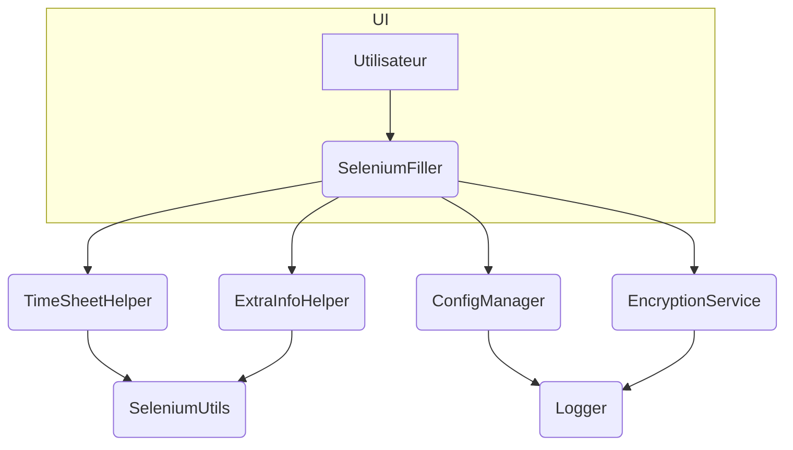

# sele_saisie_auto

[](LICENSE)
[](#)
[](#)
[](#)

## 🚀 Objectif du projet
Automatiser la saisie de la feuille de temps PSA Time via Selenium et une interface Tkinter.

## 🧰 Stack technologique
- Python 3.11
- Selenium 4.25
- Cryptography 43.0
- Dev: pytest, flake8, mypy, black, isort, ruff, radon, bandit, safety

## ⚡ Démarrage rapide
```bash
poetry install --no-root
poetry run psatime-launcher
```

## 🔧 Installation
### Pré-requis système
- Python 3.11 et [Poetry](https://python-poetry.org/)

### Depuis les sources
```bash
poetry install --no-root
```

### Mode développement
```bash
poetry install
```

### Environnement virtuel
Poetry gère automatiquement l'environnement virtuel du projet.

## ▶️ Lancement
Après installation :
```bash
poetry run psatime-launcher
```

## 📦 Utilisation
Une interface graphique Tkinter permet de renseigner vos identifiants chiffrés et déclenche l'automatisation Selenium.

## ⚙️ Utilisation avancée
- Configuration dans `config.ini`
- Logs générés dans le dossier `logs/`
- Exécution sans interface :
  ```bash
  poetry run psatime-auto
  ```

## 🔌 Injection de dépendances
Certaines fonctions acceptent les modules Selenium ou Logger en paramètres pour faciliter les tests. Voir [AGENT.md](AGENT.md) pour plus de détails.


## ❗ Gestion des erreurs
Les exceptions sont journalisées via `logger_utils.py`. Reportez-vous à la documentation interne pour enrichir le mécanisme.

## 📝 Formats d'entrée
Les paramètres sont lus depuis `config.ini` (login, mot de passe chiffré, planning, etc.).

## 🧠 Architecture

Voir [AGENT.md](AGENT.md) pour la description complète des agents.

## 📁 Structure du projet
```
.
├── main.py
├── saisie_automatiser_psatime.py
├── encryption_utils.py
├── remplir_jours_feuille_de_temps.py
├── config.ini
├── tests/
└── ...
```

## 🖥️ Compatibilité Windows
L'utilisation de PyInstaller permet de générer un exécutable Windows.

### Génération pas à pas
1. Exporter puis installer les dépendances :
   ```bash
   poetry export -f requirements.txt --output requirements.txt --without-hashes
   pip install -r requirements.txt
   ```
2. Depuis le répertoire racine, exécuter PyInstaller avec les fichiers à embarquer :
   ```bash
   pyinstaller --onefile --windowed \
     --add-data "config.ini;." \
     --add-data "calendar_icon.png;." \
     main.py
   ```
3. L'exécutable se trouve dans le dossier `dist/`. Copiez `config.ini` à côté si besoin pour conserver la configuration.

## 🛠️ Fichiers de configuration
- `config.ini` : paramètres de connexion et de planning
- `pytest.ini` : options de tests
- `.coveragerc` : configuration de couverture
- `.pre-commit-config.yaml` : hooks de lint et formatage

## 🌐 Variables d'environnement
Les valeurs de `config.ini` peuvent être surchargées via ces variables :

- `PSATIME_URL` — URL du portail PSA Time
- `PSATIME_DATE_CIBLE` — date cible au format `JJ/MM/AAAA`
- `PSATIME_LOGIN` — identifiant chiffré
- `PSATIME_MDP` — mot de passe chiffré
- `PSATIME_DEBUG_MODE` — niveau de log (`INFO`, `DEBUG`, …)
- `PSATIME_LISTE_ITEMS_PLANNING` — liste d'items de planning séparés par des virgules

Les variables d'environnement ont priorité sur le fichier de configuration.

## 🧪 Tests
```bash
poetry run pre-commit run --all-files
poetry run pytest
```
Rapports de couverture disponibles dans `htmlcov/` via `pytest --cov-report html`.

## 🔍 Qualité du code
- Formatage : `black`
- Tri des imports : `isort`
- Lint : `flake8` et `ruff`
- Analyse de complexité : `radon`
- Analyse de sécurité : `bandit` et `safety`
- Typage statique : `mypy`

## 🤝 Contribuer
Les guidelines de contribution se trouvent dans [AGENT.md](AGENT.md). Ouvrez une issue avant toute grosse modification.

## 📚 Documentation liée
- [AGENT.md](AGENT.md) — rôles des différents agents
- [design_notes.md](design_notes.md) — diagrammes et exemples d'utilisation
- [TESTING.md](TESTING.md) — stratégie de tests et conseils

## 🚀 Publication d'une release
TODO: définir la procédure de publication (Git tag, packaging, PyPI).

## 🛡️ Licence
Aucune licence spécifiée pour l'instant.
