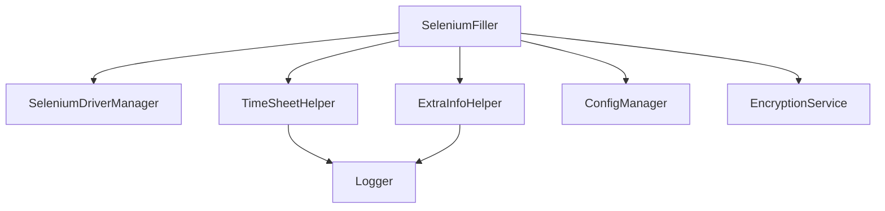
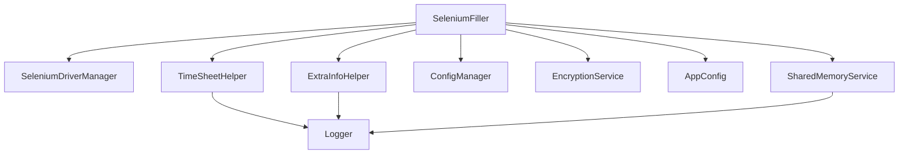

# Notes de conception

Ce document esquisse une refonte utilisant de petites classes assemblées par composition.

## Principes directeurs

- Une classe = une responsabilité.
- Pas d'héritage entre helpers : on injecte les dépendances nécessaires.
- Les guides de `AGENT.md` servent de référence.

## Composants pressentis

- **TimeSheetHelper** : gère l'insertion des jours et missions.
- **ExtraInfoHelper** : complète les informations supplémentaires.
- **ConfigManager** : charge et sauvegarde `config.ini`.
- **EncryptionService** : sécurise les identifiants.
- **SeleniumDriverManager** : ouvre et ferme le WebDriver.
- **Logger** : centralise les logs.
- **AppConfig** : dataclass représentant la configuration.
- **SharedMemoryService** : gère les segments de mémoire partagée.

`SeleniumFiller` orchestre ces agents via composition.



Chaque classe reste autonome et peut être remplacée ou testée séparément.

## Diagramme complété



## Exemples d'utilisation

```python
from app_config import load_config
from selenium_driver_manager import SeleniumDriverManager
from logging_service import Logger
from remplir_jours_feuille_de_temps import TimeSheetHelper

log_file = "logs/app.html"
logger = Logger(log_file)

# Chargement de la configuration
config = load_config(log_file)

driver_manager = SeleniumDriverManager()
driver = driver_manager.open(config.url)

try:
    helper = TimeSheetHelper(driver, config, logger)
    helper.remplir_jours()
finally:
    driver_manager.close()
```
