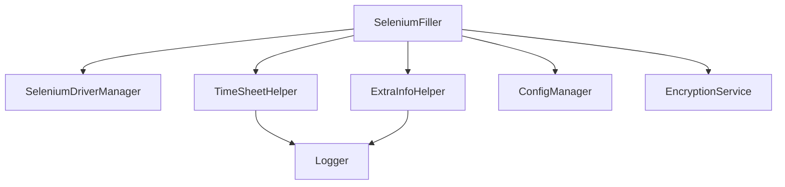

# Notes de conception

Ce document esquisse une refonte utilisant de petites classes assemblées par composition.

## Principes directeurs

- Une classe = une responsabilité.
- Pas d'héritage entre helpers : on injecte les dépendances nécessaires.
- Les guides de `AGENT.md` servent de référence.

## Composants pressentis

- **TimeSheetHelper** : gère l'insertion des jours et missions.
- **ExtraInfoHelper** : complète les informations supplémentaires.
- **ConfigManager** : charge et sauvegarde `config.ini`.
- **EncryptionService** : sécurise les identifiants.
- **SeleniumDriverManager** : ouvre et ferme le WebDriver.
- **Logger** : centralise les logs.

`SeleniumFiller` orchestre ces agents via composition.

Chaque classe reste autonome et peut être remplacée ou testée séparément.
