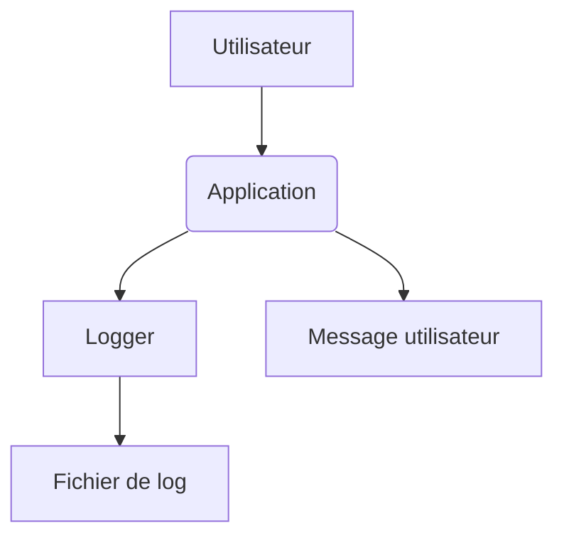

# Journalisation et gestion des erreurs

Le projet utilise le module standard `logging` pour enregistrer les différentes
étapes de la résolution. Les exceptions personnalisées sont définies dans
`exceptions.py`.



Pour activer un niveau de log détaillé :

```python
import logging

logging.basicConfig(level=logging.DEBUG)
logger = logging.getLogger(__name__)
```

Pour enregistrer les messages dans un fichier dédié :

```python
logging.basicConfig(filename="app.log")
```

Les erreurs courantes sont `DriverError`, `TimeoutError` et `InvalidConfigError`.

## Niveaux de log disponibles

Le module `logging` gère les niveaux standards :

| Niveau    | Valeur numérique |
| --------- | ---------------- |
| NOTSET    | 0                |
| DEBUG     | 10               |
| INFO      | 20               |
| WARNING   | 30               |
| ERROR     | 40               |
| CRITICAL  | 50               |

Le niveau recommandé par défaut est `INFO` afin d'obtenir des messages utiles
sans encombrer la sortie.

## Exemple de bloc `try/except`

```python
try:
    run_task()
except (DriverError, InvalidConfigError) as exc:
    logger.error("operation failed: %s", exc)
```

## Décorateur `handle_selenium_errors`

Ce décorateur capture les exceptions Selenium courantes et écrit un message
dans le journal. Il renvoie la valeur indiquée par `default_return` lorsqu'une
erreur est interceptée. Le logger passé en argument est utilisé ; à défaut, le
logger de l'instance ou celui par défaut est choisi.

```python
@handle_selenium_errors(default_return=False)
def cliquer_bouton(driver):
    driver.find_element(...).click()
```

## Fichier de log
Les messages sont enregistres dans le dossier `logs/` sous forme de fichier HTML. Chaque execution ajoute de nouvelles entrees au meme fichier afin de conserver l'historique complet.

Le texte de chaque ligne suit le modèle défini par `LOG_ENTRY_FORMAT` dans
`logger_utils.py` :

```
{timestamp} [{level}] {message}
```

### Personnaliser l'apparence
Ajoutez la section `[log_style]` dans `config.ini` :
L'outil lit ce fichier avec `ConfigParser(interpolation=None)`,
ainsi les pourcentages ne sont pas interprétés.

```ini
[log_style]
column_widths = timestamp:10%, level:6%, message:84%
row_height = 20px
font_size = 12px
```

Ces options ajustent la largeur des colonnes, la hauteur des lignes et la taille de police dans le fichier HTML.
Certaines fonctions utilitaires, comme `utils.misc.clear_screen()`,
vérifient également le code retour des commandes système et ajoutent
un message de niveau **ERROR** au journal en cas d'échec. Cela facilite
le diagnostic sur les postes où l'appel à `clear` ou `cls` pourrait être
interdit ou absent.
## Exceptions personnalisées
| Exception | Raison de l'utilisation |
| ------------------ | ---------------------------------------------------- |
| `DriverError` | Échec lors de l'initialisation du WebDriver |
| `InvalidConfigError` | Paramètres manquants ou incohérents dans `config.ini` |
| `TimeoutError` | Temps d'attente dépassé lors d'une action Selenium |
| `WebDriverException` | Erreur générique du moteur Selenium |
| `FileNotFoundError` | Fichier de configuration ou de log introuvable |
| `PermissionError` | Droits insuffisants pour accéder au fichier |
| `UnicodeDecodeError` | Caractères invalides lors de la lecture d'un fichier |
| `AutomationNotInitializedError` | Automate non initialisé avant appel |
| `RuntimeError` | État inattendu de l'application |
| `NameError` | Objet ou identifiant manquant dans le code |

## Codes de messages

Les fonctions de log acceptent un identifiant court permettant de composer le
texte final. Voici la liste des codes actuellement utilisés :

| Code | Message |
| ---- | ------- |
| `BROWSER_OPEN` | Ouverture du navigateur |
| `BROWSER_CLOSE` | Fermeture du navigateur |
| `DECRYPT_CREDENTIALS` | Déchiffrement des identifiants |
| `SEND_CREDENTIALS` | Envoi des identifiants |
| `ADDITIONAL_INFO_DONE` | Validation des informations supplémentaires terminée. |
| `SAVE_ALERT_WARNING` | ⚠️ Alerte rencontrée lors de la sauvegarde. |
| `DOM_STABLE` | Le DOM est stable. |
| `NO_DATE_CHANGE` | Aucune modification de la date nécessaire. |
| `TIME_SHEET_EXISTS_ERROR` | Feuille de temps déjà existante pour la période. |
| `MODIFY_DATE_MESSAGE` | Changer la date dans `config.ini` puis relancer. |
| `DATE_VALIDATED` | Date validée avec succès. |

## Exemple de sortie de log

```
2024-06-01 14:32:11 [INFO] Ouverture du navigateur
2024-06-01 14:32:15 [ERROR] Timeout lors du remplissage du champ
```

Pour plus d'informations sur la configuration ou l'utilisation avancée,
consultez également [configuration](configuration.md) et
[advanced-usage-example](advanced-usage-example.md).

