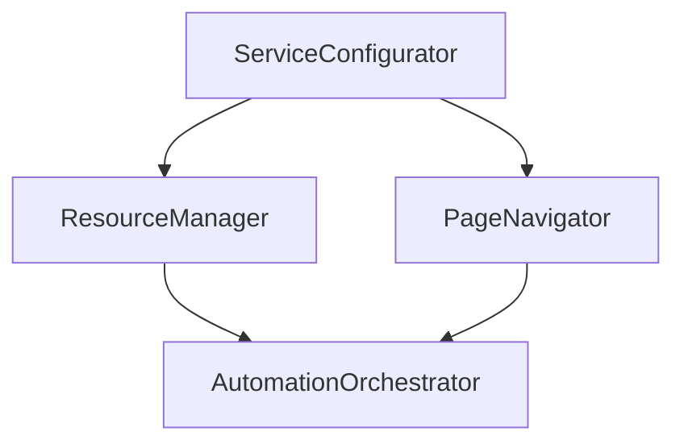

# Architecture simplifiée

Afin de clarifier la logique de l'automatisation, la classe `PSATimeAutomation` a été découpée en quatre composants principaux. Chacun se concentre désormais sur une seule responsabilité.

## Les quatre classes

- **ServiceConfigurator** – instancie le navigateur, le chiffrement et le `Waiter`.
- **ResourceManager** – gère la configuration, la session Selenium et la récupération des identifiants.
- **PageNavigator** – orchestre la connexion et la navigation dans PSA Time.
- **AutomationOrchestrator** – coordonne l'ensemble du processus en s'appuyant sur les trois précédents.

## Diagramme d'interaction

