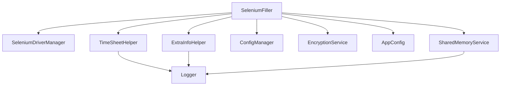

# Architecture

Ce projet implémente une série de petits modules spécialisés, tous orchestrés
par `SeleniumFiller`.  Chaque composant se concentre sur une responsabilité
distincte afin de rendre l’ensemble extensible et facilement testable.

Les principaux modules sont :

- `SeleniumFiller` : point d’entrée coordonnant l’exécution.
- `TimeSheetHelper` : insère les jours et missions dans PSA Time.
- `ExtraInfoHelper` : renseigne les informations supplémentaires.
- `ConfigManager` : charge et sauvegarde `config.ini`.
- `EncryptionService` : chiffre et déchiffre les données sensibles.
- `SeleniumDriverManager` : ouvre et ferme le WebDriver Selenium.
- `Logger` : centralise l’écriture des journaux applicatifs.
- `SharedMemoryService` : gère la mémoire partagée.

Les tests unitaires résident dans le dossier `tests/` et s’exécutent avec
`pytest`.

## Interactions principales

