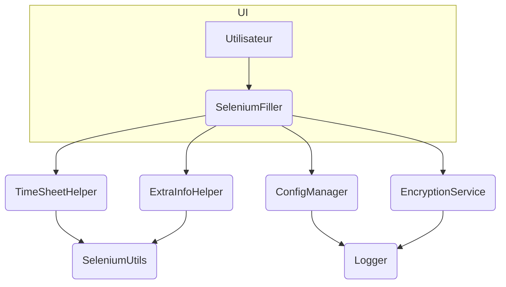

# Architecture

Le projet suit une architecture simple en plusieurs modules :

Les tests unitaires résident dans le dossier `tests/` et sont exécutés avec
`pytest`.

## Vue d’ensemble des composants

