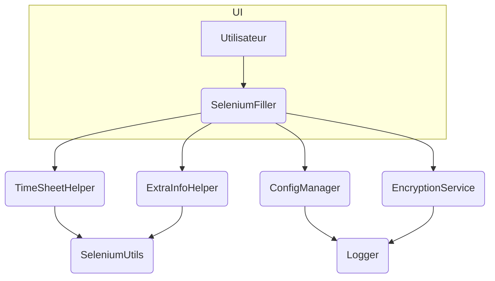

# Architecture

Le projet suit une architecture modulaire dans laquelle chaque agent assure une
responsabilité unique. `SeleniumFiller` sert de point d'orchestration et fait
appel aux modules dédiés comme `TimeSheetHelper` ou `ConfigManager`. Cette
organisation facilite la maintenance et l'ajout de nouveaux plugins.

Les tests unitaires résident dans le dossier `tests/` et sont exécutés avec
`pytest`.

## Vue d’ensemble des composants

