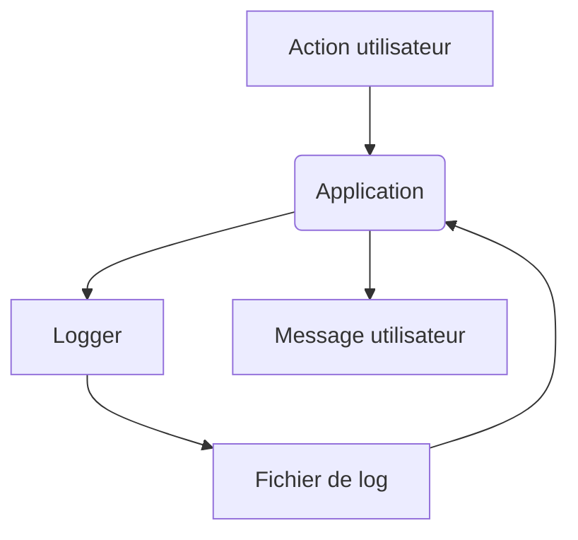

# Cycle des logs et des messages

Ce document illustre la circulation des messages lors d’une résolution.

## Étapes principales



Le cycle garantit que chaque erreur est journalisée et qu’un message clair est
retourné à l’utilisateur.

## Rediriger les logs vers un fichier

Pour conserver l'historique des événements, ajoutez un `FileHandler`
en complément du handler par défaut :

```python
import logging

logger = logging.getLogger("sele_saisie_auto")
logger.setLevel(logging.INFO)

# Utilise un gestionnaire de fichiers pour conserver l'historique
file_handler = logging.FileHandler("logs/app.log", encoding="utf-8")
formatter = logging.Formatter("%(asctime)s - %(levelname)s - %(message)s")
file_handler.setFormatter(formatter)

logger.addHandler(file_handler)
```

Si la CLI propose l'option `--debug`, activez-la pour obtenir les messages au niveau `DEBUG` dans ce fichier.
